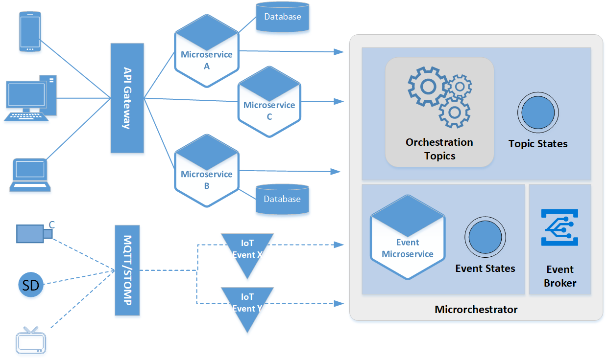

# microchestrator
Microchestrator is an implementation of Saga pattern that is used to solve eventual data consistency issue commonly encountered in microservice architecture. Saga pattern can be categoried into two type of implementation - Coreography and Orchestrator. Microchestrator is designed as a hybrid implementation of both types. The JSON configuration file, orchestration.json, determines how the microservices and events work together. It's also performs as a lightweight orchestrator to reduce a footprint and can part of Docker contatiner.
The architecture in the image below is a high-level design of Microchestrator.

